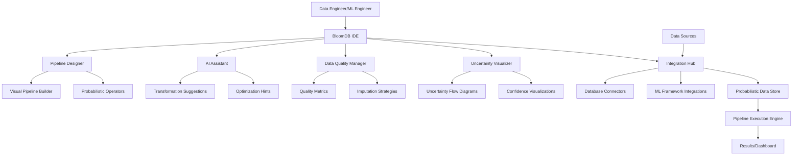

# BloomDB AI-Integrated IDE Development Plan

## Overview
BloomDB is now designed as an AI-integrated Integrated Development Environment (IDE) specifically for probabilistic database development and AI-assisted probabilistic programming. This IDE will address serious pain points in ML/AI/data science by providing intelligent tools for handling uncertainty, probabilistic modeling, and scalable computations.

## What is BloomDB IDE?
BloomDB IDE combines traditional IDE features with AI-powered tools specifically for probabilistic data pipelines and management:

### Core Components
- **Pipeline Designer**: Visual drag-and-drop interface for building probabilistic data pipelines
- **AI Assistant**: Intelligent suggestions for probabilistic transformations, uncertainty handling, and optimization
- **Data Quality Manager**: Automated detection and correction of data quality issues with probabilistic methods
- **Performance Optimizer**: AI-driven optimization of pipeline performance and scalability
- **Uncertainty Visualizer**: Interactive tools for exploring and understanding data uncertainty
- **Integration Hub**: Connectors for various data sources, ML frameworks, and probabilistic databases

### Unique Focus Areas
- Probabilistic data ingestion and transformation pipelines
- Uncertainty propagation through data workflows
- Scalable probabilistic computations in distributed environments
- AI-assisted pipeline debugging and optimization
- Integration with existing data infrastructure for probabilistic extensions

## How BloomDB IDE Addresses Existing Pain Points

### 1. Scalability of Probabilistic Computations
- **Problem**: Exponential complexity in possible worlds
- **IDE Solution**: AI-assisted optimization suggestions, visual complexity analysis, scalable code generation

### 2. Uncertainty Quantification in ML Models
- **Problem**: Lack of built-in uncertainty handling
- **IDE Solution**: Intelligent code completion for probabilistic operators, uncertainty visualization tools, automated model validation

### 3. Data Quality and Missing Values
- **Problem**: Inadequate handling of incomplete data
- **IDE Solution**: AI-powered data imputation suggestions, probabilistic data profiling, quality metrics dashboard

### 4. Integration with Existing Systems
- **Problem**: Difficulty integrating probabilistic features
- **IDE Solution**: Database connector wizards, SQL-to-probabilistic translation, API integration assistants

### 5. Probabilistic Inference on Big Data
- **Problem**: Computational expense of inference
- **IDE Solution**: Performance profiling for probabilistic code, distributed computing suggestions, optimization hints

### 6. Explainability and Interpretability
- **Problem**: Black-box probabilistic models
- **IDE Solution**: Interactive visualization of probabilistic relationships, explanation generation, uncertainty exploration tools

## IDE Architecture for Probabilistic Data Pipelines

## Development Phases

1. **Research & Design** (Current)
2. **Core Implementation**
3. **Query Engine**
4. **Programming Extensions**
5. **Optimization & Testing**

## Key Features
- Probabilistic data types (tuples with confidence)
- Query operators: SELECT with PROBABILITY, EXPECTED, etc.
- Programming constructs: probabilistic variables, sampling functions
- Integration with ML frameworks